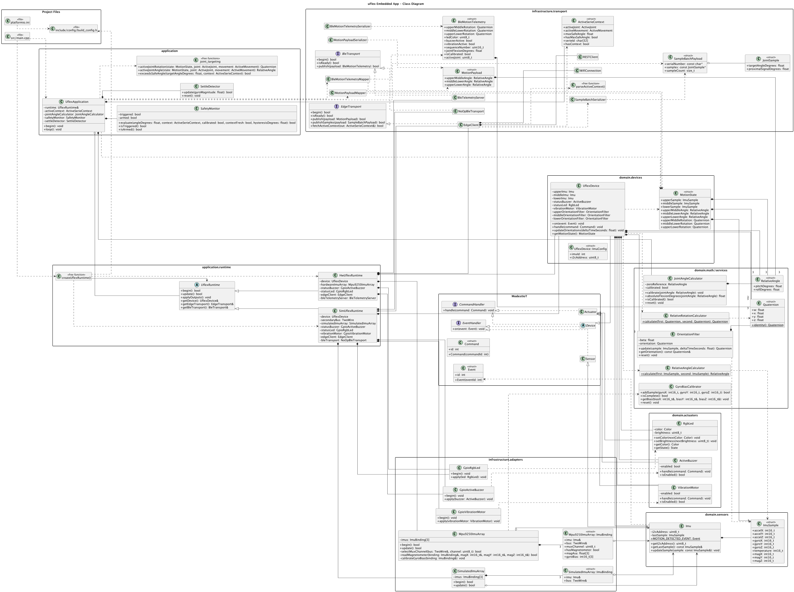

<h1 align="center">uFlex Embedded Application</h1>

<div align="center">
  
  
  
  
  <br />
  
  
  
  
</div>

---

This repository contains the **uFlex embedded firmware**, an ESP32-based
telerehabilitation project that reads three IMUs, fuses motion samples, computes
relative joint angles, applies local safety feedback, and publishes motion data
for BLE and edge-gateway integrations.

The firmware currently provides:

- a Wokwi-oriented `esp32_sim` target with simulated IMU input and no-op BLE
- an `esp32_hw` target for real MPU9250 devices behind a TCA9548A multiplexer
- a ModestIoT-aligned domain model for IMUs, the central device, and actuators
- orientation, relative-rotation, joint-angle, calibration, and safety services
- serial diagnostics, BLE avatar telemetry, and HTTP edge-gateway payloads
- a PlatformIO/Unity test suite for domain and transport logic

---

## Overview

uFlex models a limb as three instrumented segments. Each loop reads the upper,
middle, and lower IMUs, updates orientation filters, derives relative angles and
rotations, selects the active joint from the edge context, and computes the
current flexion against the calibrated zero pose.

When an active serie context is available, the firmware arms local safety logic
using the configured `maxSafeAngle`. If the target angle crosses that limit, the
device drives the buzzer and status LED immediately. Network publishing remains
separate from that local reaction: BLE telemetry is sent for the avatar stream,
and compact edge samples are sent over Wi-Fi/HTTP at a lower cadence.

The domain stays independent from Arduino, JSON, BLE, Wi-Fi, `Wire`, and board
details. Runtime wiring and infrastructure adapters own those integrations.

---

## ModestIoT

This project follows the **ModestIoT** approach as part of its academic and
architectural foundation.

In practice:

- domain IMUs align with `Sensor`
- `UflexDevice` is the central `Device`-aligned coordinator
- buzzer, RGB LED, and vibration motor are modeled as domain actuators
- event and command flow remains explicit
- `src/main.cpp` stays as a thin firmware entry point

The framework sources are preserved in [`lib/ModestIoT/`](lib/ModestIoT/).
Additional project-specific context is available in
[`lib/ModestIoT/README.md`](lib/ModestIoT/README.md).

---

## Architecture

The main firmware code lives in `lib/uflex/` and is organized into three layers:

- `domain/`
  - `Imu`, `UflexDevice`, `MotionState`, actuator models, quaternions, relative
    angle and rotation calculations, orientation filtering, and gyro bias
    calibration
- `application/`
  - `UflexApplication`, runtime selection, loop cadence, active-joint targeting,
    settle detection, calibration policy, and safety monitoring
- `infrastructure/`
  - simulated and hardware IMU adapters, GPIO actuator adapters, BLE telemetry,
    edge transport, Wi-Fi, REST, payload mapping, parsing, and serialization

Runtime selection is compile-time:

- `esp32_sim` defines `UFLEX_TARGET_SIM`
- `esp32_hw` defines `UFLEX_TARGET_HW`
- `createUflexRuntime()` returns the matching runtime

Both runtimes update the same domain `Imu` objects and expose the same
`UflexRuntime` contract, so the application loop can stay target-agnostic.

### Class Diagram



The source diagram is maintained in [`docs/class-diagram.puml`](docs/class-diagram.puml).

---

## Data Flow

The main loop follows this shape:

1. Runtime reads all IMUs and updates domain samples.
2. `UflexDevice` advances orientation filters and recalculates relative motion.
3. `UflexApplication` polls the edge down-channel for active serie context.
4. The active joint and movement are mapped to a target flexion angle.
5. Settle-based calibration captures the zero pose for each new serie.
6. `SafetyMonitor` drives local safety output when the angle exceeds the limit.
7. Motion state is mapped to BLE telemetry, edge sample batches, and serial JSON
   diagnostics.

Important identity and transport constants live in
[`include/config/build_config.h`](include/config/build_config.h), including the
kit serial, BLE advertised name, edge endpoint paths, and simulation defaults.

---

## Repository Structure

- `src/`
  - minimal firmware entry point
- `include/config/`
  - build-target, identity, and transport configuration
- `lib/ModestIoT/`
  - framework sources used as the conceptual base of the project
- `lib/uflex/`
  - main firmware code
- `docs/`
  - environment, simulation, hardware, identity, and assembly documentation
- `scripts/`
  - hardware build/upload wrappers and BLE telemetry helper tooling
- `test/`
  - PlatformIO/Unity test suites

---

## Build Targets

The firmware defines two PlatformIO environments:

- `esp32_sim`
  - simulation target
  - uses `SimUflexRuntime`, `SimulatedImuArray`, simulation Wi-Fi defaults, and
    `NoOpBleTransport`
- `esp32_hw`
  - hardware target
  - uses `HwUflexRuntime`, `Mpu9250ImuArray`, GPIO outputs, `BleTelemetryServer`,
    and `EdgeClient`

The hardware build requires Wi-Fi and edge-gateway secrets injected as build
flags. Copy `.env.example` to `.env`, fill in real values, and use the wrapper
scripts below.

---

## Prerequisites

Install:

1. **Python 3.11+**
2. **PlatformIO Core**
3. An IDE such as **VS Code** or **CLion**
4. **Wokwi** for simulation workflows

For hardware validation, use an ESP32 board, the wired IMU assembly, and any
required edge-gateway service reachable from the device network.

---

## Build Commands

```bash
# Build simulation target
pio run -e esp32_sim

# Build hardware target with secrets from .env
./scripts/build_hw.sh
.\scripts\build_hw.ps1
```

You can call `pio run -e esp32_hw` directly only if the required `UFLEX_*`
environment variables are already loaded in your shell.

See the
[Environment Setup Guide](docs/env-setup.md#7-hardware-deployment-secrets-wifi--edge-gateway)
for the hardware secret workflow.

---

## Testing

The PlatformIO/Unity suite is located in `test/test_domain/`. It covers:

- IMU initialization, sample updates, and motion-event propagation
- `MotionState` aggregation and `UflexDevice` angle recalculation
- relative angle and relative rotation calculations
- quaternion math and orientation filtering
- gyro bias calibration, settle detection, joint targeting, and safety monitor
- active context parsing
- motion payload, BLE telemetry, and sample-batch serialization

Run the suite on the simulation environment:

```bash
pio test -e esp32_sim
```

The `esp32_sim` environment is an embedded target, so running tests normally
requires a connected or simulated ESP32 test target. To compile the test
firmware without uploading or opening a test port, use:

```bash
pio test -e esp32_sim --without-uploading --without-testing
```

After changing shared firmware code, validate at least:

```bash
pio run -e esp32_sim
```

For hardware-facing changes, also run:

```bash
./scripts/build_hw.sh
```

Current limitations:

- `UflexApplication` still depends on Arduino `millis()`, `delay()`, and global
  `Serial`, so full loop cadence and diagnostics need integration-level
  validation.
- IMU adapters depend on `TwoWire`; they require Wokwi or physical I2C coverage
  beyond the current hardware-independent suite.
- Hardware behavior must be validated on the real ESP32, TCA9548A, MPU9250, and
  output wiring.

---

## Documentation

Setup and environment guides:

- [Environment Setup Guide (English)](docs/env-setup.md)
- [Guía de Configuración del Entorno (Español)](docs/env-setup.es.md)

Simulation guides:

- [Hardware Simulation Guide (English)](docs/simulation-setup.md)
- [Guía de Simulación de Hardware (Español)](docs/simulation-setup.es.md)

Hardware and device guides:

- [Hardware Overview](docs/hardware-overview.md)
- [Arm Phase Assembly Plan](docs/arm-phase-assembly-plan.md)
- [Arm Phase Guide](docs/arm-phase-guide.md)
- [Arm Phase Wiring](docs/arm-phase-wiring.md)
- [Actuator Activation Flow](docs/actuator-activation-flow.md)
- [Device Identity Contract](docs/device-identity-contract.md)

Contribution guides:

- [Contribution Guide (English)](CONTRIBUTING.md)
- [Guía de Colaboración (Español)](CONTRIBUTING.es.md)

Authors:

- [Project Authors (English)](AUTHORS.md)
- [Autores del Proyecto (Español)](AUTHORS.es.md)
