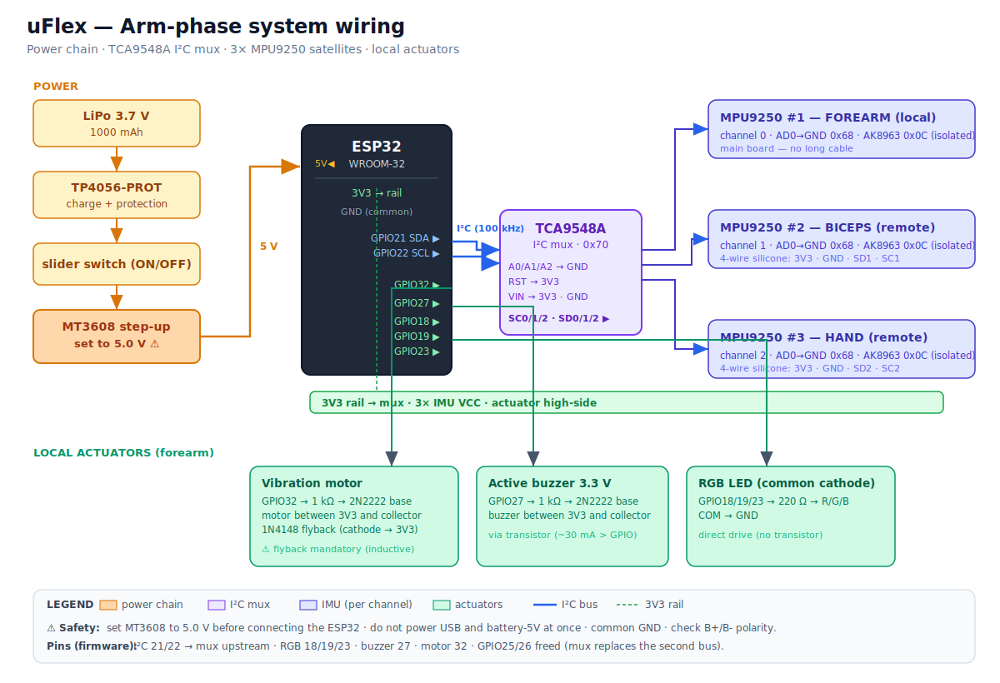

# Arm Phase Wiring & Power Design

This document is the **electrical** companion to the arm-phase build: the final wiring
design (power chain, TCA9548A I²C mux, sensors, actuators) and a step-by-step wiring guide
to take the bench prototype to a battery-powered, 3-satellite arm-mounted device.

It complements the mechanical/ergonomic docs and the sensing overview:

- [Hardware Overview](hardware-overview.md) — sensor topology and motion pipeline
- [Arm Phase Guide](arm-phase-guide.md) — materials and physical strategy
- [Arm Phase Assembly Plan](arm-phase-assembly-plan.md) — mechanical assembly sequence
- [Actuator Activation Flow](actuator-activation-flow.md) — when/why actuators fire

> **Scope.** This is a **design + wiring** document. It does **not** change firmware. The
> firmware still uses a two-bus topology today; moving to the mux requires a firmware change
> tracked in [§9](#9-firmware-delta-out-of-scope-here).

---

## 1. System diagram



> Editable source: [`assets/arm-phase-wiring/system-diagram.puml`](assets/arm-phase-wiring/system-diagram.puml)

Block view:

```text
                       ┌──────────────────────────── 3V3 rail ───────────────────────────┐
                       │              (ESP32 onboard regulator)                           │
                       ▼                          ▼                ▼                       ▼
 LiPo ─▶ TP4056 ─▶ SW ─▶ MT3608 ─▶ ESP32 ─ I²C ─▶ TCA9548A ─┬─ ch0 ─▶ MPU9250 #1 (forearm)
 3.7V    -PROT          (5.0 V)    (21/22)   (0x70)         ├─ ch1 ─▶ MPU9250 #2 (biceps)
 1000mAh                                                    └─ ch2 ─▶ MPU9250 #3 (hand)
                          │
                          ├─ GPIO32 ─▶ vibration motor (2N2222 + 1N4148)
                          ├─ GPIO27 ─▶ active buzzer    (2N2222)
                          └─ GPIO18/19/23 ─▶ RGB LED    (220 Ω each)
```

---

## 2. Pin map (firmware ground truth)

These are the pins defined in the firmware hardware runtime
(`lib/uflex/include/uflex/application/runtime/hw_uflex_runtime.h`). The wiring **must** match
them — do not invent pins.

| Function | GPIO | Notes |
| --- | --- | --- |
| I²C SDA (primary → mux upstream) | `21` | single bus to the TCA9548A |
| I²C SCL (primary → mux upstream) | `22` | single bus to the TCA9548A |
| RGB Red / Green / Blue | `18` / `19` / `23` | common cathode, 220 Ω per channel |
| Active buzzer (3.3 V) | `27` | driven via 2N2222 |
| Vibration motor | `32` | driven via 2N2222 + 1N4148 flyback |
| (Secondary I²C, old bus) | `25` / `26` | **freed** — the mux replaces the second bus |

> The bench `diagram.json` (Wokwi) and today's firmware use **two** I²C buses. The arm-phase
> design routes all three IMUs through the mux on the **single** primary bus (21/22), which
> frees `GPIO25/26`.

---

## 3. I²C topology with the TCA9548A

```text
ESP32 GPIO21(SDA)/22(SCL) ──▶ TCA9548A upstream (SDA/SCL)   addr 0x70
                              ├── SD0/SC0 ──▶ MPU9250 #1  (forearm, local)
                              ├── SD1/SC1 ──▶ MPU9250 #2  (biceps, remote)
                              └── SD2/SC2 ──▶ MPU9250 #3  (hand, remote)
```

**Mux wiring**

| TCA9548A pin | Connect to | Why |
| --- | --- | --- |
| `VIN` | 3V3 rail | logic + bus power |
| `GND` | GND (common) | |
| `SDA` / `SCL` | `GPIO21` / `GPIO22` | upstream bus from the ESP32 |
| `A0` / `A1` / `A2` | GND | sets I²C address **0x70** |
| `RST` | 3V3 (or a spare GPIO) | keep out of reset; GPIO only if you want SW reset |
| `SC0..2` / `SD0..2` | one MPU9250 each | downstream channels |

**Each MPU9250**: `VCC → 3V3`, `GND → GND`, `AD0 → GND`. With the mux, all three sit at the
same address `0x68` because only one channel is selected at a time.

**Why the mux.** Each MPU9250 carries an AK8963 magnetometer at the fixed I²C address `0x0C`,
so the three collide on a shared bus (and master-mode multi-master contention makes the second
IMU on a bus fail to init). The TCA9548A isolates each IMU on its own channel, so **all three
magnetometers become readable** — the prerequisite for real compensation detection (a yaw
signal). See the blocker note in [Hardware Overview](hardware-overview.md#status--notes).

**Long-cable note.** The biceps and hand IMUs sit ~30–40 cm away over flexible wire. Run I²C
at **100 kHz**. The MPU9250 modules carry ~4.7 kΩ pull-ups, which now sit **downstream per
channel** (good — the mux isolates each segment's capacitance). Verify the mux breakout has
**upstream** pull-ups on its SDA/SCL (most HW-617 boards do); if not, add ~4.7 kΩ on the
upstream bus.

---

## 4. Power chain (1000 mAh battery)

```text
LiPo 3.7 V 1000 mAh ──▶ TP4056-PROT (B+/B-)
TP4056-PROT OUT+ ──▶ slider switch ──▶ MT3608 IN+
TP4056-PROT OUT- ───────────────────▶ MT3608 IN-
MT3608 OUT+ (adjusted to 5.0 V) ──▶ ESP32 "5V" / "VIN"
MT3608 OUT- ──▶ ESP32 GND
ESP32 3V3 (onboard regulator) ──▶ TCA9548A + 3× MPU9250 + actuator high-side
```

- **Use the TP4056-PROT** (the one with battery protection), not the plain TP4056.
- **The AMS1117-3.3 is not used** as main power: its ~1.1 V dropout cannot regulate a 3.7 V
  battery (it would need ≥4.4 V in). The ESP32's onboard regulator already provides 3V3.
- **Runtime estimate (1000 mAh):** ~**4–6 h** typical, ~3 h under heavy Wi-Fi
  (≈120 mA @ 5 V → ≈0.19 A from the battery → ≈5 h). Comfortable for test sessions.
- **Decoupling:** a **100 µF** electrolytic on the 5 V rail near the ESP32 and a **10 µF** on
  3V3 smooth the Wi-Fi current bursts. Both are in inventory.

---

## 5. Actuator driver sub-circuits

All actuators live on the **forearm** main board.

**Vibration motor** — GPIO32

```text
GPIO32 ──[1 kΩ]── B
                  │ 2N2222 (NPN)
              C ──┴── motor(−)        motor(+) ── 3V3
              E ───── GND
       1N4148 across the motor: cathode → 3V3, anode → collector  (flyback)
```

**Active buzzer (3.3 V)** — GPIO27

```text
GPIO27 ──[1 kΩ]── B
                  │ 2N2222 (NPN)
              C ──┴── buzzer(−)       buzzer(+) ── 3V3
              E ───── GND
```

Driven through a transistor because an active buzzer draws ~30 mA (> the ~20 mA recommended
per GPIO).

**RGB LED (common cathode)** — GPIO18/19/23

```text
GPIO18 ──[220 Ω]── R ┐
GPIO19 ──[220 Ω]── G ├─ RGB LED   COM ── GND
GPIO23 ──[220 Ω]── B ┘
```

Direct drive (each channel < 20 mA), no transistor needed.

**Inventory check:** 2× 2N2222, 2× 1 kΩ, 2× 1N4148 (1 for the motor + 1 spare), 3× 220 Ω — exact fit. ✔

---

## 6. Inter-satellite cabling

Each **remote** satellite (biceps, hand) connects to its mux channel with **4 conductors** in
flexible AWG24 silicone wire:

| Wire | Signal | Suggested color |
| --- | --- | --- |
| 1 | `3V3` | red |
| 2 | `GND` | black |
| 3 | `SDx` (channel SDA) | blue |
| 4 | `SCx` (channel SCL) | (4th color) |

Leave slack across the elbow and wrist; add strain relief so motion never pulls on a solder
joint or the IMU. The mechanical mounting (bands, EVA, layer stack) is covered in the
[Arm Phase Assembly Plan](arm-phase-assembly-plan.md).

---

## 7. Safety warnings

1. **Adjust the MT3608 to 5.0 V with a multimeter BEFORE connecting the ESP32.** It ships near
   its maximum; turn the trimpot down, measure, set 5.0 V, *then* connect. An unadjusted MT3608
   will destroy the ESP32.
2. **Do not power from USB and battery-5V at the same time.** Cheap devkits tie USB 5V to the
   5V pin without a diode → back-feed. Use USB to flash, battery to run.
3. **Common ground** everywhere (battery, boost, ESP32, mux, actuators).
4. **Check battery polarity** into the TP4056 `B+/B-`.

---

## 8. Step-by-step wiring guide

This is the **electrical** sequence; pair it with the mechanical sequence in the
[Assembly Plan](arm-phase-assembly-plan.md).

**Stage 0 — Bench baseline**
1. Confirm the current firmware reads the IMUs and fires the actuators on the bench.

**Stage 1 — Power stage**
1. Wire LiPo → TP4056-PROT → slider switch → MT3608.
2. With the MT3608 **disconnected from the ESP32**, power it and set the output to **5.0 V**.
3. Connect MT3608 5 V → ESP32 `5V/VIN`; confirm the ESP32 boots on battery.

**Stage 2 — Mux + local IMU**
1. Wire the TCA9548A: `VIN→3V3`, `GND→GND`, `SDA→GPIO21`, `SCL→GPIO22`, `RST→3V3`, `A0/A1/A2→GND`.
2. Wire the forearm MPU9250 to channel 0 (`SD0/SC0`), `AD0→GND`.

**Stage 3 — Actuators**
1. Build the motor driver (with the 1N4148 flyback), the buzzer driver, and the RGB resistors
   per [§5](#5-actuator-driver-sub-circuits).

**Stage 4 — Remote satellites**
1. Run 4-wire silicone to the biceps IMU → channel 1, and to the hand IMU → channel 2.

**Stage 5 — Power-on checks**
1. I²C scan **per channel** (select 0x70 channel, scan): each channel shows one device at `0x68`.
2. Read the magnetometer per channel (non-zero `HX/HY/HZ`).
3. Fire each actuator (motor pulse, buzzer pulse, RGB colors).

---

## 9. Firmware delta (out of scope here)

This document describes the **target wiring**. The firmware does **not** drive the mux yet:

- Today: two I²C buses (`Wire` 21/22, `Wire1` 26/25), AK8963 read in **I²C master mode**.
- Target: a single bus through the TCA9548A, **selecting the channel** (`write 1<<n to 0x70`)
  before talking to each IMU. With the mux isolating each AK8963, the magnetometer read can go
  back to **bypass per channel** instead of master mode.

That firmware change is a separate follow-up and is **not** part of this design doc.
