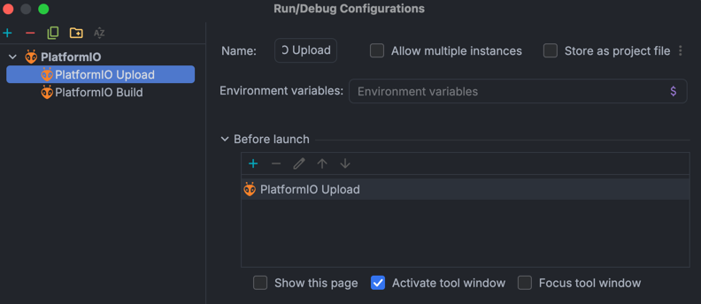

# Guía de Configuración del Entorno

Este documento proporciona instrucciones paso a paso para configurar tu entorno de desarrollo local para la aplicación embebida de uFlex. Sigue los pasos correspondientes a tu sistema operativo e Interfaz de Desarrollo Integrada (IDE) preferida.

---

## 1. Prerrequisitos del Sistema e Instalación del Core

PlatformIO Core actúa como el motor de compilación y requiere Python para operar. Selecciona tu sistema operativo a continuación para instalar las dependencias del core de forma global.

### macOS
1.  **Instala Homebrew** (si no lo tienes instalado) ejecutando el script oficial en tu Terminal:
    ```bash
    /bin/bash -c "$(curl -fsSL https://raw.githubusercontent.com/Homebrew/install/HEAD/install.sh)"
    ```
2.  **Instala PlatformIO Core** usando Homebrew, el cual gestionará automáticamente la dependencia de Python:
    ```bash
    brew install platformio
    ```
3.  **Verifica la instalación** comprobando la versión:
    ```bash
    pio --version
    ```
    *Nota: Las versiones modernas de macOS incluyen extensiones nativas del kernel para el chip CP2102 USB-to-Serial. No se requiere la instalación de controladores adicionales.*

### Windows
1.  **Instala Python 3.11+**: Descarga e instala Python desde la Microsoft Store (recomendado para la configuración automática de variables de entorno) o desde el sitio web oficial de Python. Si utilizas el instalador ejecutable, asegúrate de marcar la casilla **"Add Python to PATH"** antes de continuar.
2.  **Instala PlatformIO Core**: Abre PowerShell o el Símbolo del Sistema como Administrador y ejecuta:
    ```powershell
    pip install -U platformio
    ```
3.  **Instala el controlador CP210x USB to UART Bridge Driver**: Para permitir que Windows se comunique con el hardware del ESP32 a través de USB-C, debes instalar manualmente el controlador de Silicon Labs:
    > **Nota de Hardware Importante:** Este paso de instalación manual está incluido de forma exclusiva para el chip puente **CP2102**, que es el componente que utiliza nuestro modelo de ESP32 estándar en este proyecto. Si estás trabajando en otro repositorio o tu hardware utiliza una variante diferente de chip (como la serie ESP32-S3 o ESP32-C3 con soporte USB nativo, o un chip puente alternativo como el CH340), este controlador no funcionará. En ese caso, debes revisar el número de modelo impreso físicamente en el silicio de tu placa y consultar su documentación oficial correspondiente para instalar el driver correcto.
    * Descarga el archivo oficial directamente desde este enlace: [CP210x_Universal_Windows_Driver.zip](https://www.silabs.com/documents/public/software/CP210x_Universal_Windows_Driver.zip).
    * Localiza el archivo `.zip` descargado en tu explorador de archivos, haz clic derecho sobre él y selecciona **Extraer todo...** para descomprimir los archivos en una carpeta estándar.
    * Abre la carpeta extraída, busca el archivo de información de instalación llamado **`silabser.inf`** (tiene un ícono de engranaje o página y puede aparecer solo como `silabser` si las extensiones de archivo están ocultas).
    * Haz clic derecho sobre **`silabser.inf`** y selecciona **Instalar** en el menú contextual (en Windows 11, es posible que primero debas hacer clic en *Mostrar más opciones* para ver el botón Instalar). Confirma el aviso de administrador para completar el proceso.
4.  **Verifica la instalación**: Cierra la terminal, abre una nueva sesión y verifica la configuración de la ruta global:
    ```powershell
    pio --version
    ```

### Linux (Basado en Ubuntu/Debian)
1.  **Instala Python y pip** a través del gestor de paquetes:
    ```bash
    sudo apt update
    sudo apt install python3 python3-pip python3-venv
    ```
2.  **Instala PlatformIO Core** a través de pip:
    ```bash
    pip3 install -U platformio
    ```
3.  **Configura los permisos USB (reglas de udev)** para permitir que tu sistema se comunique con el microcontrolador ESP32 sin privilegios de root:
    ```bash
    curl -fsSL https://raw.githubusercontent.com/platformio/platformio-core/master/src/platformio/assets/system/99-platformio-udev.rules | sudo tee /etc/udev/rules.d/99-platformio-udev.rules
    sudo service udev restart
    sudo usermod -a -G dialout $USER
    sudo usermod -a -G plugdev $USER
    ```

---

## 2. Verificación de la Conectividad del Microcontrolador vía Terminal

Antes de abrir tu IDE, se recomienda verificar que tu sistema operativo reconozca correctamente el ESP32 al conectarlo mediante un cable USB-C. Ejecuta el comando correspondiente a tu plataforma para confirmar el enlace de la dirección de hardware.

### Verificación en macOS
Abre tu Terminal y filtra los dispositivos de llamada (cu) disponibles utilizando el prefijo del puerto serie:
```bash
ls /dev/cu.usbserial*
```
**Resultado Esperado:** La terminal debería devolver una ruta enlazada que coincida con tu interfaz periférica, como:
```text
/dev/cu.usbserial-0001
```

### Verificación en Windows
Conecta el ESP32 a tu computadora y ejecuta uno de los siguientes comandos de diagnóstico según la consola que estés utilizando:

* **Usando PowerShell:**
  ```powershell
  Get-CimInstance -ClassName Win32_SerialPort | Select-Object DeviceID, Description
  ```
* **Usando el Símbolo del Sistema (CMD):**
  ```cmd
  wmic path Win32_SerialPort get DeviceID,Description
  ```
  **Resultado Esperado:** La consola mostrará las rutas del índice de espacio de trabajo asignadas dinámicamente, por ejemplo:
  ```text
  DeviceID    Description
  COM3        Silicon Labs CP210x USB to UART Bridge
  ```

### Verificación en Linux
Abre tu entorno de consola e inspecciona los registros del buffer del núcleo del sistema inmediatamente después de conectar el cable del dispositivo USB-C:
```bash
dmesg | grep ttyUSB
```
**Resultado Esperado:** La interfaz de registro de hardware del sistema transmitirá los bloques de enlace del proceso de conexión, revelando el identificador del nodo del canal serie:
```text
[ 1024.567890] usb 1-1: cp210x converter now attached to ttyUSB0
```

---

## 3. Configuración del IDE

Una vez que PlatformIO Core y la conectividad física del hardware estén verificados en tu sistema, configura ya sea VS Code o CLion.

### Opción A: Visual Studio Code (VS Code)
1.  Abre VS Code y navega al menú del marketplace de **Extensiones** (atajo: `Ctrl+Shift+X` o `Cmd+Shift+X`).
2.  Busca **PlatformIO IDE** y haz clic en **Install**.

    

3.  Espera a que se complete la sincronización interna del core. Reinicia VS Code si se te solicita.
4.  La integración proporciona un ícono dedicado de PlatformIO en la barra lateral y una barra de estado inferior que contiene los controles de ejecución para la compilación (`✓`) y la carga/flasheo del código (`→`).

### Opción B: JetBrains CLion
Las versiones modernas de CLion gestionan PlatformIO de forma nativa a través de sus funciones de desarrollo embebido.
1.  Abre CLion y navega a **Settings** (o *Preferences* en macOS) > **Plugins**.
2.  Bajo la pestaña **Installed**, verifica si **PlatformIO Integration** ya está activa (habilitada por defecto en versiones modernas bajo la sección de Embedded Development). Si no se encuentra, cambia a la pestaña **Marketplace**, busca **PlatformIO Integration**, instálala y reinicia el IDE.

    

3.  Ve a **Settings** > **Languages & Frameworks** > **PlatformIO**.
4.  Verifica la ruta de instalación del ejecutable de PlatformIO (**PlatformIO Executable Installation Path**):
    * **macOS (Homebrew):** `/opt/homebrew/bin` o `/usr/local/bin`
    * **Windows:** `C:\Users\<Tu_Usuario>\.platformio\penv\Scripts\platformio.exe` (o la ruta respectiva de los scripts de Python).

---

## 4. Apertura y Sincronización del Proyecto

### En VS Code
1.  Selecciona **File** > **Open Folder** y elige el directorio raíz que contiene el archivo `platformio.ini`.
2.  PlatformIO analizará automáticamente el espacio de trabajo y descargará las herramientas de compilación y librerías externas especificadas bajo la propiedad `lib_deps`.

### En CLion
1.  Selecciona **File** > **Open** y elige el directorio raíz del proyecto. Asegúrate de abrir la carpeta como un contexto de proyecto de PlatformIO seleccionando el archivo de configuración `platformio.ini` si el IDE lo solicita.
2.  CLion analizará de forma nativa la configuración de `platformio.ini` para mapear símbolos e indexar las estructuras de código directamente.
3.  Se recomienda encarecidamente configurar la interfaz de **Run Configuration** para alternar fácilmente entre las operaciones de compilación y carga. Para hacer esto:
    * Haz clic en el menú desplegable de objetivos de ejecución situado en la barra de herramientas superior derecha y selecciona **Edit Configurations...**.
    * Asegúrate de tener opciones mapeadas al entorno de PlatformIO. Puedes verificar una configuración que apunte a `PlatformIO Build` para comprobar la sintaxis del código, y otra que apunte a `PlatformIO Upload` para compilar y flashear el binario en el hardware del ESP32 a través de USB-C.
    
    

---

## 5. Controles de Despliegue de Hardware y Gestión de Puertos

Para programar y monitorear con éxito tu hardware, ambos IDEs proporcionan interfaces de barra de herramientas especializadas para manejar el enrutamiento del entorno y las conexiones de los dispositivos objetivos.

### Gestión de Entornos Objetivos y Puertos de Hardware en VS Code
VS Code utiliza dos componentes principales de configuración ubicados en la interfaz de estado de la barra de herramientas inferior:

* **Switch PlatformIO Project Environment:** Este menú desplegable muestra tu perfil de ejecución actual mapeado desde los ajustes de `platformio.ini` (por ejemplo, `env:esp32dev`). Si existen múltiples entornos de desarrollo o configuraciones en un espacio de trabajo, hacer clic en este botón permite alternar y cambiar el pipeline de compilación.
* **Set upload/monitor/test port:** Representado por el ícono de un enchufe en la barra inferior. Por defecto, está configurado en **Auto**, lo que fuerza al ecosistema a escanear automáticamente las rutas físicas COM/USB disponibles para encontrar un microprocesador conectado. Si hay múltiples nodos serie activos, haz clic en este botón para abrir un menú desplegable y especificar manualmente la línea del puerto de comunicación.

### Gestión de Entornos Objetivos y Puertos de Hardware en CLion
Al escribir flujos de código embebido en los ecosistemas de JetBrains, el enrutamiento de los objetivos y los puntos de comunicación se manejan a través de componentes dedicados de la barra de herramientas:

* **PlatformIO Project Environment Selector:** Ubicado como un componente de selección independiente en la interfaz de configuración periférica (mostrando etiquetas como `esp32dev`). Si tu espacio de trabajo apunta a diferentes configuraciones de hardware o construcciones en paralelo, haz clic en este menú desplegable para enrutar dinámicamente las señales de compilación a ese contexto de perfil específico.
* **Campos de Upload port / Monitor port:** Dentro de las estructuras de configuración, la interfaz incluye casillas de verificación explícitas para el puerto de carga (**Upload port**). Mantener marcada la casilla **Auto** permite que PlatformIO localice dinámicamente la interfaz del controlador conectado (por ejemplo, enlazándose secuencialmente a puntos finales como `/dev/ttyUSB0` en Linux/macOS o `COM3` en Windows). Si las rutinas de descubrimiento automático entran en conflicto, desmarca la casilla **Auto** y selecciona manualmente tu línea de interfaz física asignada en la lista desplegable del campo de entrada.

---

## 6. Reindexación de Dependencias y Resolución de Errores de Sintaxis

Cada vez que se añadan, modifiquen o eliminen librerías externas dentro del archivo `platformio.ini`, el indexador de código interno del IDE podría perder temporalmente el rastro de los archivos de cabecera, lo que resulta en falsos errores de validación de sintaxis (por ejemplo, líneas rojas que subrayan las directivas `#include`).

Para forzar al espacio de trabajo a actualizar su configuración de indexación y habilitar las funciones de autocompletado, sigue los pasos rápidos basados en tu IDE activo:

### Resolver la indexación de código en VS Code
1. Abre la Paleta de Comandos usando el atajo `Ctrl+Shift+P` (Windows/Linux) o `Cmd+Shift+P` (macOS).
2. Escribe y selecciona la siguiente operación:
   ```text
   PlatformIO: Rebuild IntelliSense Index
   ```
3. Espera a que la rutina de la terminal termine de actualizar las definiciones del servidor de lenguaje de C++.

### Resolver la indexación de código en CLion
Puedes activar la sincronización utilizando la interfaz gráfica (recomendado) o la terminal:

* **Método 1 (Interfaz Gráfica):** Localiza la ventana de herramientas del panel lateral de **PlatformIO** en el lado derecho de CLion. En la parte superior del panel, haz clic en el botón **Reload PlatformIO Project** (representado por el ícono de una hormiga dentro de flechas circulares).
* **Método 2 (Alternativa por Terminal):** Abre la terminal integrada, asegúrate de estar en el directorio raíz del proyecto y ejecuta:
  ```bash
  pio project init --ide clion
  ```
