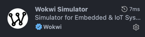
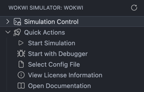
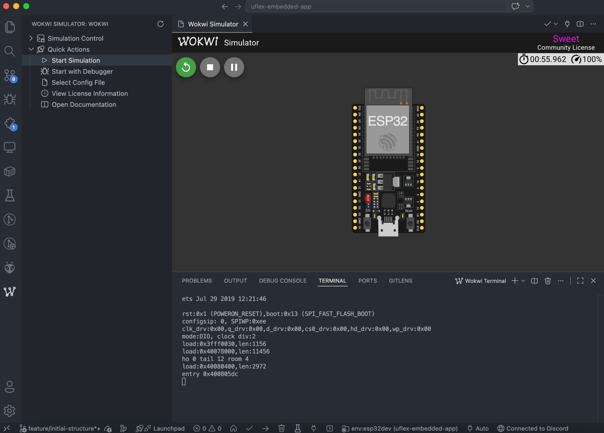
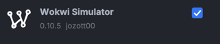
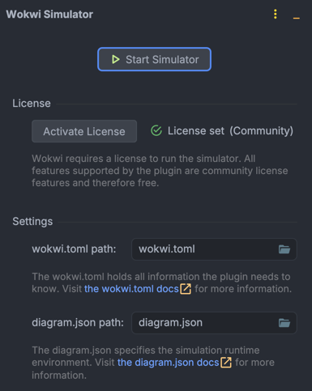
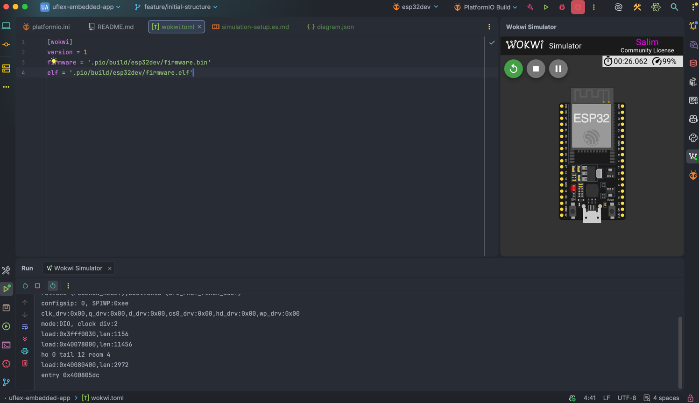

# Guía de Simulación de Hardware (Integración con Wokwi)

Este documento proporciona instrucciones paso a paso para configurar y ejecutar simulaciones de hardware locales para la aplicación embebida de uFlex. Esto te permite probar la lógica del código, las entradas de los sensores o el enrutamiento del multiplexor sin necesidad de tener el hardware físico conectado a tu computadora.

---

## 1. Configuración de Simulación Compartida

Tanto VS Code como CLion utilizan los mismos parámetros subyacentes del motor de simulación de Wokwi. Antes de configurar tu IDE específico, debes asegurarte de tener los siguientes archivos en la raíz del proyecto (al mismo nivel que el archivo `platformio.ini`).

### 1. Compilar el Environment Correcto de PlatformIO
Este repositorio utiliza múltiples environments en `platformio.ini`. Para la simulación con Wokwi, el environment esperado es `esp32_sim`, mientras que `esp32_hw` queda reservado para hardware real.

Antes de iniciar Wokwi, compila explícitamente el environment de simulación desde la pestaña de PlatformIO de tu IDE, o usa el siguiente comando:

```bash
pio run -e esp32_sim
```

### 2. Definir el Mapa del Firmware Target (`wokwi.toml`)
Asegúrate de tener el siguiente archivo en la raíz del proyecto llamado `wokwi.toml` con definiciones estructurales para enrutar el simulador hacia tus binarios compilados por PlatformIO y registrar los custom chips que la simulación necesite cargar:

```toml
[wokwi]
version = 1
firmware = '.pio/build/esp32_sim/firmware.bin'
elf = '.pio/build/esp32_sim/firmware.elf'

[[chip]]
name = 'tca9548a'
binary = 'chips/tca9548a/dist/tca9548a.chip.wasm'
```

> **Importante:** Asegúrate de compilar el environment `esp32_sim` al menos una vez antes de lanzar la simulación. Si no compilas primero, las carpetas internas y los archivos `firmware.bin` y `firmware.elf` no existirán en el disco, por lo que el simulador no podrá reconocer las rutas y lanzará un error de inicialización.

### 3. Definir el Esquema del Circuito Electrónico (`diagram.json`)
Asegúrate de tener el siguiente archivo en la raíz del proyecto llamado `diagram.json` para mapear las conexiones de tu placa de hardware virtual.
> **Nota:** Puedes usar el mismo archivo `diagram.json` que generes al diseñar tu circuito visualmente en la [Página Oficial de Wokwi](https://wokwi.com). Solo cablea el ESP32, los sensores y actuadores en el editor web, haz clic en la pestaña **diagram.json** dentro de su espacio de trabajo, copia el contenido y pégalo directamente en tu archivo local.

### 4. Mantener los Custom Chips del Proyecto
Este repositorio puede incluir uno o más custom chips de Wokwi para simular periféricos o componentes que no existan de forma nativa en el catálogo del simulador. La estructura recomendada es:

```text
chips/
  common/
    wokwi-api.h
  nombre_del_chip/
    src/
      main.c
    dist/
      nombre_del_chip.chip.json
      nombre_del_chip.chip.wasm
```

Puntos importantes:

1. `main.c` es el código fuente del custom chip.
2. `wokwi-api.h` es necesario para compilar los chips, pero no forma parte del firmware del ESP32.
3. El archivo `.chip.json` y el archivo `.chip.wasm` de cada chip deben mantenerse juntos dentro de `dist/`.
4. Los custom chips se usan solo durante la simulación; no se flashean al hardware real.

### 5. Recompilar un Custom Chip Cuando Cambie
Si modificas el código fuente de un custom chip, debes recompilarlo para regenerar el artefacto WebAssembly.

Para hacerlo, primero instala la herramienta [wokwi-cli](https://github.com/wokwi/wokwi-cli). Luego ejecuta un comando como el siguiente:

```bash
wokwi-cli chip compile chips/tca9548a/src/main.c -o chips/tca9548a/dist/tca9548a.chip.wasm
```

---

## 2. Opción A: Configuración en Visual Studio Code

VS Code interactúa con el entorno de simulación a través de la extensión oficial de Wokwi.

### Instalación y Licencias
1. Abre VS Code y navega al menú del marketplace de **Extensiones** (`Ctrl+Shift+X` o `Cmd+Shift+X`).
2. Busca **Wokwi Simulator** e instala la extensión.

    

3. Dirígete a la barra lateral izquierda de VS Code y abre la pestaña de **Wokwi Simulator**.
4. Sigue las instrucciones de redirección en el navegador para activar tu token de desarrollador gratuito para el simulador.

   

### Ejecución del Simulador
1. Asegúrate de que tu código fuente compile limpiamente usando el environment `esp32_sim`, ya sea desde el botón de PlatformIO Build (`✓`) o ejecutando `pio run -e esp32_sim`.
2. Dirígete a la barra lateral izquierda de VS Code y abre la pestaña de **Wokwi Simulator**.
3. Despliega la sección **Quick Actions** dentro del panel de control de simulación.
4. Haz clic en la opción **Start Simulation** para inicializar el entorno virtual.
5. Se abrirá una pestaña interactiva con la pantalla gráfica de tus componentes electrónicos cableados. Las lecturas y logs del puerto serie virtual se transmitirán inmediatamente a tu terminal integrada en la parte inferior de la pantalla.

   

---

## 3. Opción B: Configuración en JetBrains CLion

CLion gestiona las simulaciones a través de un panel de control dedicado que se integra en la barra de herramientas lateral del IDE.

### Instalación y Vinculación del Espacio de Trabajo
1. Abre CLion y ve a **Settings** (o *Preferences* en macOS) > **Plugins**.
2. Cambia a la pestaña **Marketplace**, busca **Wokwi Simulator**, instala el módulo del plugin y reinicia el IDE.

   

3. Al reiniciar, notarás que se añade una nueva pestaña llamada **Wokwi Simulator** en el extremo del panel lateral derecho de CLion.

### Activación de Licencia y Configuración de Rutas
Antes de lanzar el entorno virtual, debes validar el estado del plugin y mapear tus archivos locales:

1. Haz clic en la pestaña de **Wokwi Simulator** en el panel derecho de CLion para desplegar su interfaz.
2. Si es la primera vez que lo abres, sigue las instrucciones para activar la licencia gratuita de desarrollador a través de tu navegador web.
3. En la sección **Settings** configura de forma estricta las rutas de comunicación:
   * **wokwi.toml path:** Haz clic en el ícono de la carpeta y selecciona el archivo `wokwi.toml` ubicado en la raíz de tu proyecto.
   * **diagram.json path:** Selecciona el archivo `diagram.json` de la raíz del proyecto de la misma manera.

      

### Ejecución de la Simulación
1. **Paso Obligatorio de Compilación:** Dirígete primero a la pestaña **PlatformIO** y realiza un **Build** del environment `esp32_sim` para generar el firmware actualizado en el almacenamiento local.
2. Regresa a la pestaña de **Wokwi Simulator** en el panel derecho.
3. Haz clic en el botón superior **Start Simulator**.
4. Un lienzo interactivo con tu circuito electrónico virtualizado se abrirá inmediatamente como una pestaña nativa dentro del editor de CLion, capturando el flujo de datos del puerto serie en tiempo real.

   

> **Advertencia actual del proyecto:** En este repositorio, la simulación con custom chips ha funcionado de forma más estable en VS Code que en CLion. Si el plugin de CLion no detecta o no ejecuta correctamente el custom chip, utiliza VS Code como entorno de simulación principal hasta verificar compatibilidad completa en JetBrains.
